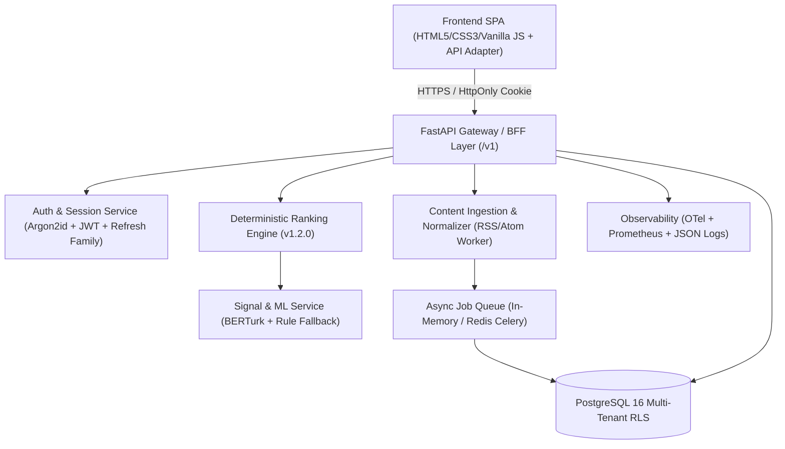

# Architecture Decision Record (ADR)
## MoodFeed Production Productization and Architecture Baseline

- **Status:** Approved / Active
- **Date:** 2026-08-22
- **Scope:** MoodFeed MVP to Closed Beta Production Architecture
- **Authors:** MoodFeed Engineering & Platform Team

---

### 1. Context & Problem Statement
MoodFeed has completed its MVP validation phase with deterministic reranking, rule-based & BERTurk sentiment/toxicity scoring, explanation drawer, side-by-side A/B comparison, pilot evaluation, and in-memory RAM sessions. To transition into a robust, secure, closed-beta multi-tenant SaaS application while strictly honoring user privacy and zero unauthorized tracking, a comprehensive production architecture is required.

---

### 2. Architecture Decisions Matrix

#### Decision 1: Backend Framework
- **Decision:** FastAPI (Python 3.11+) with Pydantic v2 validation and Starlette middleware.
- **Rationale:** High-performance async I/O, strict OpenAPI / JSON schema generation, dependency injection, and native integration with Python ML/NLP ecosystems.

#### Decision 2: Frontend/Backend Boundary (BFF & API Adapter)
- **Decision:** Backend-For-Frontend (BFF) pattern mediated by `MoodFeedApiAdapter` with distinct `MockAdapter` and `RealApiAdapter` implementations.
- **Rationale:** Prevents browser-side secret exposure, standardizes error shapes (`code`, `message`, `request_id`, `retryable`), and permits seamless development/demo mode vs authenticated production API execution.

#### Decision 3: Database Technology
- **Decision:** PostgreSQL 16 with Row-Level Security (RLS) policies and UUIDv4 primary keys.
- **Rationale:** ACID guarantees for user consents and preferences, JSONB support for ranking score breakdowns, and native support for continuous WAL archiving (PITR).

#### Decision 4: Authentication & Password Security
- **Decision:** Argon2id / PBKDF2-SHA256 password hashing (minimum 64MB memory cost or 600k iterations) and JWT token family with automatic refresh rotation and server-side revocation lists.
- **Rationale:** Protection against brute-force and credential stuffing; complies with OWASP ASVS Level 2.

#### Decision 5: Session Management
- **Decision:** SameSite=Lax, HttpOnly, Secure session cookies for web clients with CSRF protection; bearer tokens for programmatic API access.
- **Rationale:** Eliminates XSS token exfiltration risks from `localStorage`.

#### Decision 6: Content Source Ingestion Strategy
- **Decision:** Polling worker with RSS/Atom syndication parsing, content-hash deduplication, strict HTML sanitization, and exponential backoff retry.
- **Rationale:** Secure, single-provider starting point without scraping private platforms or requesting user credentials.

#### Decision 7: Deterministic Ranking Strategy
- **Decision:** Versioned mathematical formula $\text{score} = \text{clamp}(S_{\text{orig}} - W_{\text{tox}} \cdot T - W_{\text{neg}} \cdot N \cdot R + W_{\text{div}} \cdot D \cdot R)$ with bounded penalties and stable tie-breaking on `original_rank`.
- **Rationale:** Reproducible, transparent, verifiable ordering without arbitrary black-box randomness.

#### Decision 8: Signal & ML Fallback Strategy
- **Decision:** BERTurk transformer pipeline with automatic, graceful fallback to RuleBasedTurkishScorer upon import, load, or latency exception ($>500\text{ ms}$).
- **Rationale:** Guarantees zero 500 errors and transparently communicates active scorer status to the user.

#### Decision 9: Background Queue & Task Processing
- **Decision:** Generic asynchronous task queue interface (`JobQueueInterface`) with an in-memory worker for single-node / development and Celery/Redis adapter for production clustering.
- **Rationale:** Decouples ingestion, export packaging, and deletion cleanup from the synchronous HTTP request path.

#### Decision 10: Storage & Export Delivery
- **Decision:** Client-side streaming blob export for standard payloads; signed short-lived ($<15\text{ min}$) download URLs for asynchronous background export packages.
- **Rationale:** Prevents unauthorized file access and memory spikes on server nodes.

#### Decision 11: Observability & Telemetry
- **Decision:** Structured JSON logging (`timestamp`, `level`, `service`, `request_id`, `route`, `latency_ms`), OpenTelemetry spans, Prometheus metrics (`/v1/system/metrics`), and `X-Process-Time-Ms` headers. Sensitive data (passwords, tokens, raw text, PII) is strictly redacted at the logger boundary.
- **Rationale:** Complete production visibility without violating user privacy.

#### Decision 12: Deployment & Infrastructure
- **Decision:** Multi-stage Docker containerization running under non-root user `appuser` (UID 10001), healthcheck probes (`/v1/system/health`, `/v1/system/readiness`), and declarative `docker-compose` staging profiles.
- **Rationale:** Immutable, reproducible deployments with zero host pollution.

#### Decision 13: Backup & Disaster Recovery
- **Decision:** Daily automated PostgreSQL `pg_dump` snapshots with continuous WAL archiving to an encrypted secondary location; maximum RPO of 15 minutes, RTO of 30 minutes.
- **Rationale:** Verifiable disaster recovery with documented restoration drill runbooks.

#### Decision 14: Privacy & Data Governance (GDPR / KVKK)
- **Decision:** Explicit consent records (`consents` table), purpose-limited data processing, zero health/mental-state profiling, and automated data portability/deletion workflows (`POST /v1/privacy/data/export`, `POST /v1/privacy/data/deletion`).
- **Rationale:** Complete adherence to data subject rights and transparency principles.

#### Decision 15: Content Moderation Boundary
- **Decision:** Multi-state moderation lifecycle (`pending`, `allowed`, `limited`, `blocked`, `needs_review`) strictly separated from algorithmic ranking adjustments.
- **Rationale:** Prevents equating negative sentiment with harmfulness and provides auditability for moderator actions.

#### Decision 16: Feature Flags
- **Decision:** Typed configuration-driven feature flags (`ENABLE_MOCK_ADAPTER`, `CONTENT_PROVIDER_ENABLED`, `ENABLE_AUTH`, `ENABLE_PERSISTENCE`, `ENABLE_PILOT_MODE`).
- **Rationale:** Enables safe canary rollouts and instant operational kill-switches.
