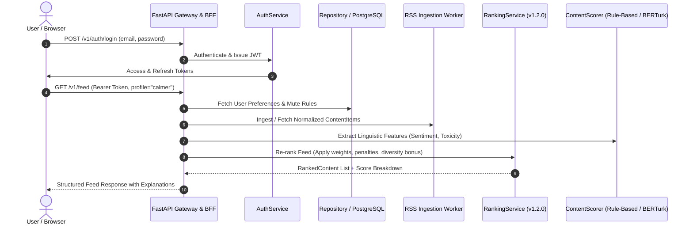
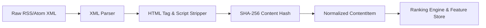

# MoodFeed System Architecture & Data Flow Diagram

---

## 1. End-to-End Data Pipeline

```mermaid
sequenceDiagram
    autonumber
    actor User as User / Browser
    participant Gateway as FastAPI Gateway & BFF
    participant Auth as AuthService
    participant Repo as Repository / PostgreSQL
    participant Worker as RSS Ingestion Worker
    participant Engine as RankingService (v1.2.0)
    participant Scorer as ContentScorer (Rule-Based / BERTurk)

    User->>Gateway: POST /v1/auth/login (email, password)
    Gateway->>Auth: Authenticate & Issue JWT
    Auth->>User: Access & Refresh Tokens

    User->>Gateway: GET /v1/feed (Bearer Token, profile="calmer")
    Gateway->>Repo: Fetch User Preferences & Mute Rules
    Gateway->>Worker: Ingest / Fetch Normalized ContentItems
    Gateway->>Scorer: Extract Linguistic Features (Sentiment, Toxicity)
    Gateway->>Engine: Re-rank Feed (Apply weights, penalties, diversity bonus)
    Engine-->>Gateway: RankedContent List + Score Breakdown
    Gateway-->>User: Structured Feed Response with Explanations
```

---

## 2. Ingestion & Sanitization Boundary

```mermaid
graph LR
    A["Raw RSS/Atom XML"] --> B["XML Parser"]
    B --> C["HTML Tag & Script Stripper"]
    C --> D["SHA-256 Content Hash"]
    D --> E["Normalized ContentItem"]
    E --> F["Ranking Engine & Feature Store"]
```
