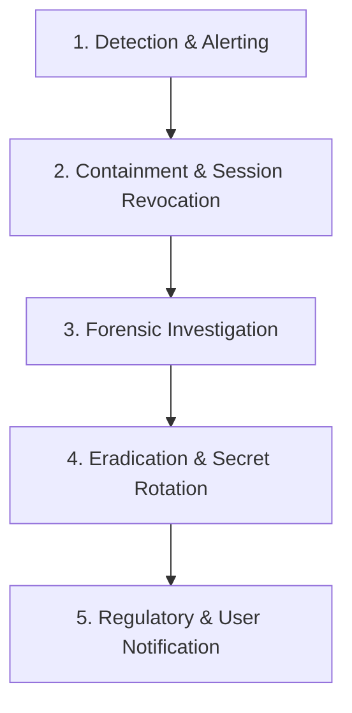

# MoodFeed Privacy & Data Breach Incident Response Runbook

- **Standard:** GDPR Art. 33/34 (72-Hour Notification Rule) & KVKK Madde 12
- **Objective:** Immediate triage, containment, and notification protocol in the event of suspected data exposure.

---

## 1. Incident Classification

| Severity | Definition | Target Containment SLA | Notification Obligation |
| :--- | :--- | :--- | :--- |
| **P1 - Critical** | Unauthorized access to user password hashes, email directory, or active token families | < 1 hour | Supervisory authority within 72h; affected users immediately |
| **P2 - High** | Exposure of anonymized sentiment scores, aggregated feedback, or configuration | < 4 hours | Internal audit report; assessment of risk to data subjects |
| **P3 - Medium** | Local log file containing IP addresses without proper retention truncation | < 24 hours | Internal patch; log rotation verification |

---

## 2. Five-Phase Response Workflow



1. **Detection:** Triggered by anomalous auth failures, unauthorized API queries, or integrity monitor alerts.
2. **Containment:** Immediately revoke all active token families:
   ```sql
   UPDATE sessions SET is_revoked = TRUE WHERE is_revoked = FALSE;
   ```
3. **Investigation:** Inspect structured JSON access logs filtering by affected `request_id` and timestamp.
4. **Secret Rotation:** Rotate `JWT_SECRET`, `SESSION_SECRET`, and database master passwords.
5. **Notification:** Prepare formal incident report and notify regulatory authorities (KVKK / DPC) within 72 hours.
